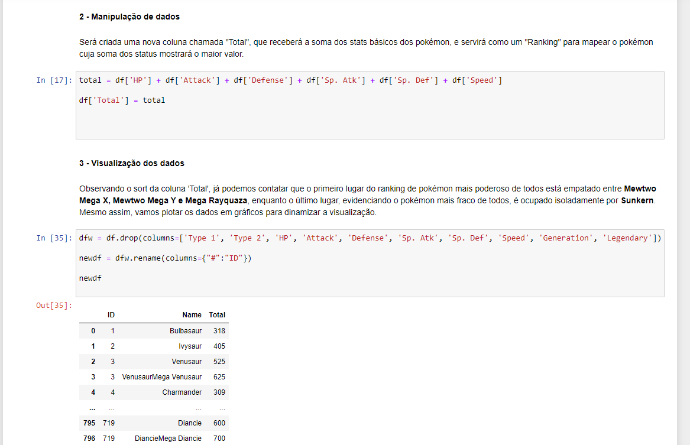

#### Sobre

Exercício básico de data science utilizando python 3 para análise de dados, a fim
de descobrir qual o pokémon mais poderoso da atualidade, através de um coeficiente
que irá ranquear os níveis de poder

#### Observação

Exercício ainda está em suas fases iniciais, faltam dezenas de atualizações e
informações a serem adicionadas.